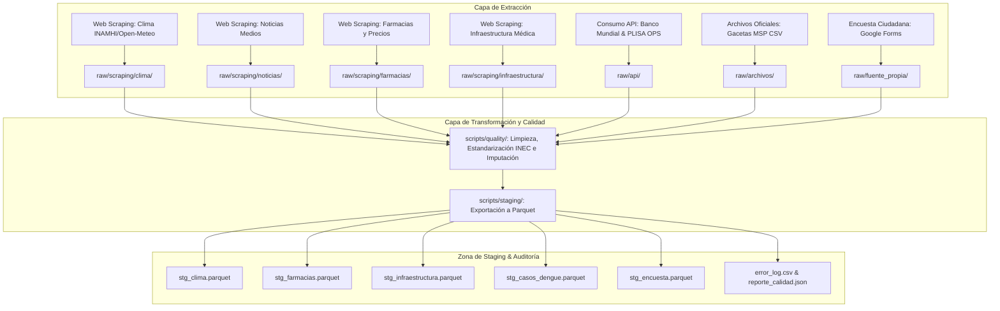

# Arquitectura del Pipeline ETL de Inteligencia de Negocios para Gestión Multipatología Nacional

Este documento presenta el diseño arquitectónico de la plataforma de extracción, transformación y carga (ETL) para la toma de decisiones en salud pública a nivel nacional en Ecuador.

## 1. Visión General y Flujo de Datos

El pipeline sigue el paradigma clásico por capas para garantizar la **inmutabilidad de los datos crudos (Zona RAW)** y asegurar el **procesamiento analítico de alto rendimiento (Zona STAGING en Parquet)**.

## 2. Principios del Framework de Calidad

- **Estandarización Geográfica Nacional:** Los nombres de provincias y cantones se normalizan rigurosamente de acuerdo con el catálogo del Instituto Nacional de Estadística y Censos (INEC), abarcando los 220+ cantones y 24 provincias de Ecuador.
- **Formato Parquet Columnar:** Toda la capa Staging emplea formato **Parquet**, optimizando la compresión en disco, manteniendo la tipificación estricta de las variables de clima, infraestructura y casos sanitarios, mejorando la velocidad de carga al Data Warehouse en MySQL.
- **Tratamiento Avanzado de Nulos:** Se aplican estrategias de imputación por mediana agrupada por cantón (temperaturas, humedad y tiempos de espera hospitalarios) o por medicamento (precios y stocks farmacéuticos).
