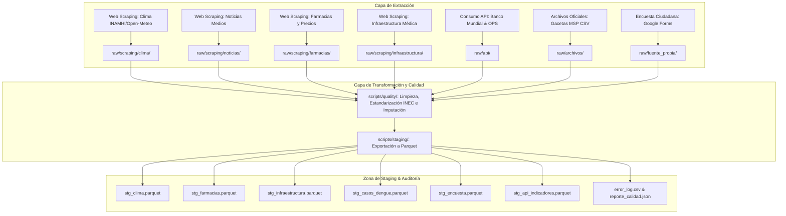

# Arquitectura del Pipeline ETL de Inteligencia de Negocios para Gestión de Dengue

Este documento presenta el diseño arquitectónico de la plataforma de extracción, transformación y carga (ETL) para la toma de decisiones en salud pública en la provincia de Santa Elena.

## 1. Visión General y Flujo de Datos

El pipeline sigue el paradigma clásico por capas para garantizar la **inmutabilidad de los datos crudos (Zona RAW)** y asegurar el **procesamiento analítico de alto rendimiento (Zona STAGING en Parquet)**.

## 2. Principios del Framework de Calidad

- **Estandarización Geográfica**: Los nombres de cantones se normalizan rigurosamente al catálogo oficial del Instituto Nacional de Estadística y Censos (INEC): `SANTA ELENA`, `LA LIBERTAD` y `SALINAS`.
- **Formato Parquet**: Toda la capa Staging abandona el uso de archivos CSV temporales para emplear formato **Parquet**, optimizando el espacio en disco, manteniendo la tipificación estricta y mejorando los tiempos de lectura para las dimensiones y hechos en el Data Warehouse.
- **Tratamiento Avanzado de Nulos**: Se aplican estrategias de imputación por mediana según agrupaciones lógicas (ej. precio de medicamentos por principio activo, o temperaturas y tiempos de espera hospitalaria por cantón).
